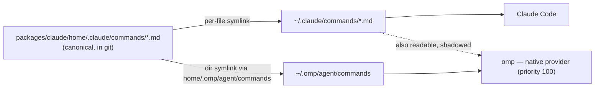

# claude — Claude Code config + shared agent commands

Manages Claude Code's user-level config and the slash-command library that is
**shared with the Oh My Pi (`omp`) harness**.

## What this package manages

| Path                            | Form              | Why                                                                                       |
| ------------------------------- | ----------------- | ----------------------------------------------------------------------------------------- |
| `~/.claude/commands/*.md`       | per-file symlinks | Claude Code user commands. Per-file so unmanaged local commands can live alongside them   |
| `~/.omp/agent/commands`         | directory symlink | Same files, exposed to `omp`'s **native** command provider. Nothing else writes here      |
| `~/.local/bin/claude-turn-*`    | symlinks          | Stop / UserPromptSubmit hook scripts referenced from `settings.json`                      |
| `~/.claude/skills/{kit,effect}` | per-file symlinks | Skill payloads, shipped so a fresh machine's `~/.claude` works from dot alone (see below) |

## Skills payload

`home/.claude/skills/` carries two skills as real files so a fresh machine gets a
working `~/.claude` from dot alone, without any other checkout: `kit` (this machine's
house rules, authoritative at `/data/code/fleet/skills/kit`) and `effect` (vendored
material, authoritative at `/data/code/fleet/vendor/kit-skills/`).

The kit copy is **generated, not edited**. After changing any file under
`/data/code/fleet/skills/kit/`, regenerate it:

```sh
cd /data/code/fleet && bun run sync:skills   # copies the seven kit files here
```

Parity between the copy and its authority is gated by `bun run probe:skill-parity` in
fleet's `check` chain — the probe fails when the two disagree, and the gate has been
seen fail (2026-08-25: three files drifted after a prettier run).

`.prettierignore` excludes `packages/claude/home/.claude/skills/` because both prettier
paths here — `just format` and the pre-commit hook — rewrite markdown emphasis
(`*word*` → `_word_`) and reformat embedded code fences, so without the exclusion a
sync from the authority is reverted by the next format or commit.

## Sharing one command library across both harnesses

Canonical source: `home/.claude/commands/*.md`. One copy, two consumers.



`home/.omp/agent/commands` is a **relative symlink inside the repo**
(`../../.claude/commands`). `dot link` walks `home/` with `readdir` +
`Dirent.isDirectory()`, so a symlinked directory is emitted as a _single_ link
entry rather than being traversed — `~/.omp/agent/commands` becomes one symlink
that chains through the repo to the real command directory.

### Why the two sides use different link granularity

- **`~/.claude/commands` is per-file.** Claude Code itself writes into this
  directory, and non-dot local commands should be able to sit next to the
  managed ones. Cost: adding a new command file needs `dot pkg claude link`
  before Claude Code sees it — the normal dot workflow for every package.
- **`~/.omp/agent/commands` is the whole directory.** No `omp` feature writes
  user commands there (`omp agents unpack` targets `~/.omp/agent/agents`), so
  owning the whole path is safe and means new commands appear in `omp`
  immediately, with no re-link.

### Duplicate discovery in omp is expected and harmless

`omp` finds each command twice: once via the `native` provider
(`~/.omp/agent/commands`, priority 100) and once via the `claude` compat
provider (`~/.claude/commands`, priority 80). Capability dedup is first-wins by
name, so `native` always wins; the loser is kept only in the shadowed list shown
by the Extensions dashboard.

To silence the shadow entries entirely, set in `~/.omp/agent/config.yml`:

```yaml
commands:
  enableClaudeUser: false
```

Left at the default (`true`) on purpose — it keeps any _unmanaged_ command
dropped into `~/.claude/commands` visible to `omp` too.

### Profile caveat

The native symlink covers the **default** `omp` profile only. Named profiles
read `~/.omp/profiles/<name>/agent/commands`. Add one symlink per profile under
`home/.omp/profiles/<name>/agent/commands` if you start using them.

## Adding a command

```sh
$EDITOR /data/config/dot/packages/claude/home/.claude/commands/my-command.md
dot pkg claude link   # links the new file into ~/.claude/commands
```

`omp` picks it up with no re-link. Verify both harnesses:

```sh
omp   -p '/my-command'
claude -p '/my-command'
```

## Verify the wiring

```sh
dot doctor claude   # expect: no broken symlinks or drift
readlink ~/.omp/agent/commands                    # -> packages/claude/home/.omp/agent/commands
ls ~/.omp/agent/commands/                         # -> the same 15 .md files as ~/.claude/commands
```
