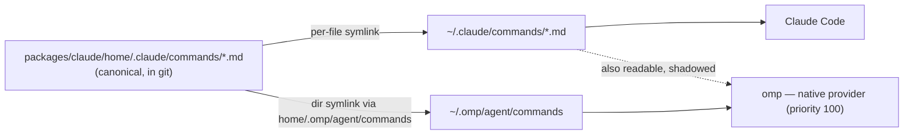

# claude — Claude Code config + shared agent commands

Manages Claude Code's user-level config and the slash-command library that is
**shared with the Oh My Pi (`omp`) harness**.

## What this package manages

| Path                                                                    | Form                          | Why                                                                                      |
| ----------------------------------------------------------------------- | ----------------------------- | ---------------------------------------------------------------------------------------- |
| `~/.claude/commands/*.md`                                               | per-file symlinks             | Claude Code user commands. Per-file so unmanaged local commands can live alongside them  |
| `~/.omp/agent/commands`                                                 | directory symlink             | Same files, exposed to `omp`'s **native** command provider. Nothing else writes here     |
| `~/.local/bin/claude-turn-*`                                            | symlinks                      | Stop / UserPromptSubmit hook scripts referenced from `settings.json`                     |
| `~/.claude/skills/<fleet skill>`                                        | symlinks (via `configure.sh`) | Every `<fleet>/skills/<name>` fleet does not keep fleet-only; no copy, no drift possible |
| `~/.claude/{CLAUDE.md,SHARED.md,COMMUNICATION.md,DOTFILES.md,TESTS.md}` | per-file symlinks             | Machine-wide instructions. `SHARED.md` is the part both harnesses read                   |
| `~/.omp/agent/AGENTS.md`                                                | per-file symlink              | omp's user context file: one line, `@~/.claude/SHARED.md`                                |
| `~/.omp/agent/skills`                                                   | symlink (via `configure.sh`)  | Points at `~/.claude/skills`, so omp offers the same skills as Claude Code               |

## Skills payload

Every skill's source lives in the repo it describes, and `~/.claude/skills` holds only links
to it — never a folder of its own:

- this package's own skills (`home/.claude/skills/`) and agent-web's are linked by dot;
- fleet's skills are source code in fleet, one folder each under `<fleet>/skills/`.
  `configure.sh` links every one of them, except a skill fleet links from its own committed
  `.claude/skills/` — that one is fleet-only (`kit`, `ui`, `effect`) and loads only inside
  fleet. There is no list here: adding a skill, or making one fleet-only, is a fleet commit,
  and the next `dot pkg claude configure` links it or removes the link. The checkout path is
  the per-host record `packages/dot/bootstrap.sh` writes;
- `playwright-cli` is generated by the CLI into a cache and linked by agent-web's
  `configure.sh`;
- `~/.claude/skills/synced` is Claude Code's own download of claude.ai skills — the one folder
  here nothing in dot writes.

## One set of instructions for both harnesses

omp does not read `~/.claude` at all by default: its `enabledProviders` setting starts
empty, and foreign user-level sources (Claude, Codex, Cursor…) load only when listed. So
`CLAUDE.md` and `~/.claude/skills` never reached omp, and each rule had to be bridged by
hand. `COMMUNICATION.md` never got a bridge and went unread by omp for a month.

Listing `claude` in `enabledProviders` would fix that, but it also pulls in Claude's hooks,
plugins, MCP servers and settings, and `config.yml` is not in this repo. Instead:

```
CLAUDE.md  = @~/.claude/WEB-VERIFY.md + @~/.claude/SHARED.md (+ Claude-only lines)
SHARED.md  = @~/.claude/DOTFILES.md + @~/.claude/COMMUNICATION.md + @~/.claude/TESTS.md
~/.omp/agent/AGENTS.md = @~/.claude/SHARED.md
```

- **A new machine-wide rule goes into `SHARED.md`**, not `CLAUDE.md`, so both harnesses read
  it. `CLAUDE.md` holds only what Claude Code alone should see.
- **`WEB-VERIFY.md` stays out of `SHARED.md` on purpose.** omp already reads it as a sticky
  rule (`~/.omp/agent/RULES.md`, from the agent-web package), which is resent with every
  request and reaches subagents. Importing it again would load it twice.
- **Every Claude profile reads the same file.** `configure.sh` links
  `~/.claude-work/CLAUDE.md` and `~/.claude-personal/CLAUDE.md` to `~/.claude/CLAUDE.md`;
  before that, the personal profile held a one-line real file and got only web-verify.
  Imports are absolute (`@~/.claude/…`) so they resolve the same way through those links.
- **omp subagents do not get `SHARED.md`**: omp strips files named `AGENTS.md` when it spawns
  one. Subagents do not talk to the user; the sticky web-verify rule still reaches them.

Verify both:

```sh
omp -p --model @smol "No tools. Does your system prompt contain 'The reader's attention is the scarce resource'? YES/NO"
CLAUDE_CONFIG_DIR=~/.claude-work claude -p --model haiku "No tools. Do your instructions contain 'The reader's attention is the scarce resource'? YES/NO"
```

## Sharing one command library across both harnesses

Canonical source: `home/.claude/commands/*.md`. One copy, two consumers.


```mermaid
graph LR
  A["packages/claude/home/.claude/commands/*.md<br/>(canonical, in git)"]
  A -->|per-file symlink| B["~/.claude/commands/*.md"]
  A -->|dir symlink via home/.omp/agent/commands| C["~/.omp/agent/commands"]
  B --> D["Claude Code"]
  C --> E["omp — native provider (priority 100)"]
  B -.->|"also readable, shadowed"| E
```

`home/.omp/agent/commands` is a **relative symlink inside the repo**
(`../../.claude/commands`). dot's linker walks `home/` with `readdir` +
`Dirent.isDirectory()`, so a symlinked directory is emitted as a _single_ link
entry rather than being traversed — `~/.omp/agent/commands` becomes one symlink
that chains through the repo to the real command directory.

### Why the two sides use different link granularity

- **`~/.claude/commands` is per-file.** Claude Code itself writes into this
  directory, and non-dot local commands should be able to sit next to the
  managed ones. Cost: adding a new command file needs `dot pkg claude link`
  before Claude Code sees it — the normal dot workflow for every package.
- **`~/.omp/agent/commands` is the whole directory.** No `omp` feature writes
  user commands there (`omp agents unpack` targets `~/.omp/agent/agents`), so
  owning the whole path is safe and means new commands appear in `omp`
  immediately, with no re-link.

### Duplicate discovery in omp is expected and harmless

`omp` finds each command twice: once via the `native` provider
(`~/.omp/agent/commands`, priority 100) and once via the `claude` compat
provider (`~/.claude/commands`, priority 80). Capability dedup is first-wins by
name, so `native` always wins; the loser is kept only in the shadowed list shown
by the Extensions dashboard.

To silence the shadow entries entirely, set in `~/.omp/agent/config.yml`:

```yaml
commands:
  enableClaudeUser: false
```

Left at the default (`true`) on purpose — it keeps any _unmanaged_ command
dropped into `~/.claude/commands` visible to `omp` too.

### Profile caveat

The native symlink covers the **default** `omp` profile only. Named profiles
read `~/.omp/profiles/<name>/agent/commands`. Add one symlink per profile under
`home/.omp/profiles/<name>/agent/commands` if you start using them.

## Adding a command

```sh
$EDITOR /data/config/dot/packages/claude/home/.claude/commands/my-command.md
dot pkg claude link   # links the new file into ~/.claude/commands
```

`omp` picks it up with no re-link. Verify both harnesses:

```sh
omp   -p '/my-command'
claude -p '/my-command'
```

## Verify the wiring

```sh
dot doctor claude   # expect: no broken symlinks or drift
readlink ~/.omp/agent/commands                    # -> packages/claude/home/.omp/agent/commands
ls ~/.omp/agent/commands/                         # -> the same 15 .md files as ~/.claude/commands
```
